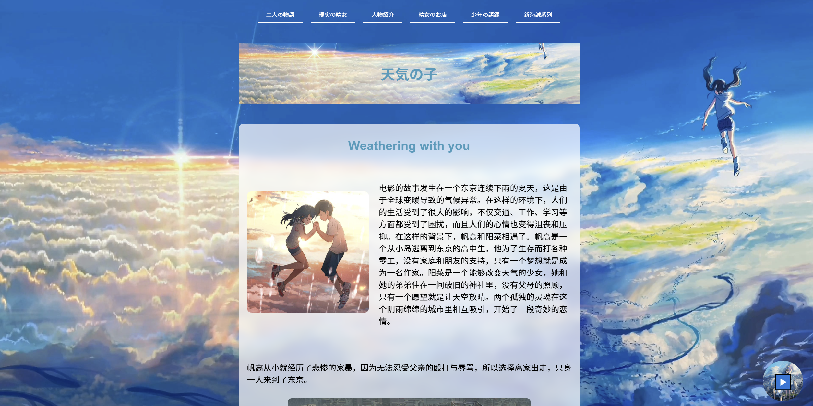
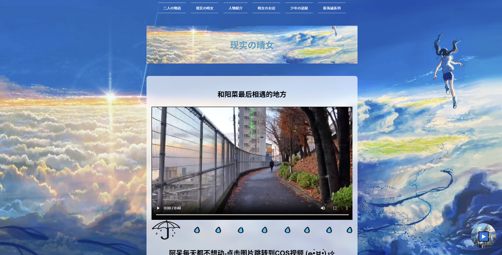
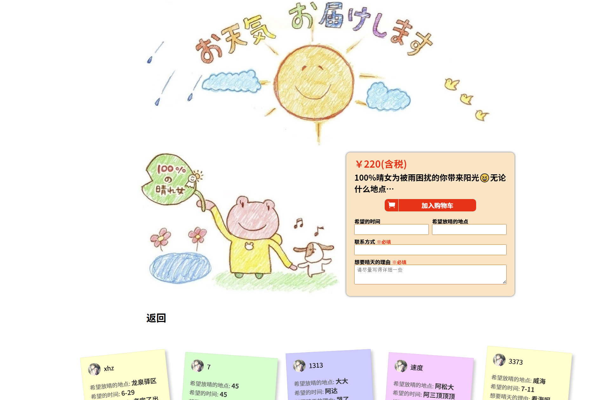

# Otenki Girl — 『天気の子』ファンサイト

[English](README.md) | 日本語 | [简体中文](README.zh-CN.md)



『天気の子』をモチーフにしたフロントエンドのファンサイトです。物語や登場人物を、動画背景、画像、音楽、ナビゲーション、モーダルなどを使って紹介します。

## スクリーンショット

| テーマページ | コンテンツセクション |
| --- | --- |
|  |  |

## 主な機能

- 全画面のループ動画背景
- ストーリーと人物紹介ページ
- レスポンシブなナビゲーションと新海誠作品ページ
- BGMの再生・一時停止
- 画像パネルとアニメーションコンテンツ
- 「私たちについて」のモーダル
- 晴れサービスを表現する`OtenkiGirl-master`サブプロジェクト

## 技術スタック

- HTML5
- CSS3
- Vanilla JavaScript
- 画像、GIF、MP4動画、MP3音声
- 元のプロジェクト説明によると、同梱の`OtenkiGirl-master`実装ではGUNを使用

## ディレクトリ構成

```text
.
├── assets/                 # README用スクリーンショット
├── css/                    # メインサイトのスタイル
├── img/                    # 画像と動画
├── js/                     # メインサイトのスクリプト
├── music/                  # BGM
├── OtenkiGirl-master/      # 晴れサービスのサブプロジェクト
├── index.html              # メインエントリ
├── 2.html
├── 3.html
├── 5.html
└── 6.html
```

## ローカル実行

ビルドは不要です。

1. リポジトリをクローンします。

   ```bash
   git clone https://github.com/1xiaohuozi/Otenki-Girl-tenkinoko.git
   cd Otenki-Girl-tenkinoko
   ```

2. モダンブラウザで`index.html`を開きます。

任意の静的HTTPサーバーを使うこともできます。

```bash
python -m http.server 8000
```

その後、`http://localhost:8000/`へアクセスします。

## 使い方

- ナビゲーションメニューから各テーマページへ移動します。
- 音楽ボタンでBGMを再生・一時停止します。
- 新海誠シリーズのページで画像パネルを閲覧します。
- 「私たちについて」からチーム情報のモーダルを開きます。

ブラウザの自動再生制限により、BGMはユーザー操作後に再生される場合があります。

## クレジット

元の中国語ドキュメントでは、晴れサービス部分に[IvanLuLyf/OtenkiGirl](https://github.com/IvanLuLyf/OtenkiGirl)で統合された成果物を使用したと説明されています。当該部分を再配布・変更する場合は、上流のクレジットを維持してください。

## 免責事項

本リポジトリは学習目的の非公式ファンプロジェクトです。『天気の子』に関連する名称、画像、動画、音声などの権利は各権利者に帰属します。独立したライセンスファイルは含まれていません。
